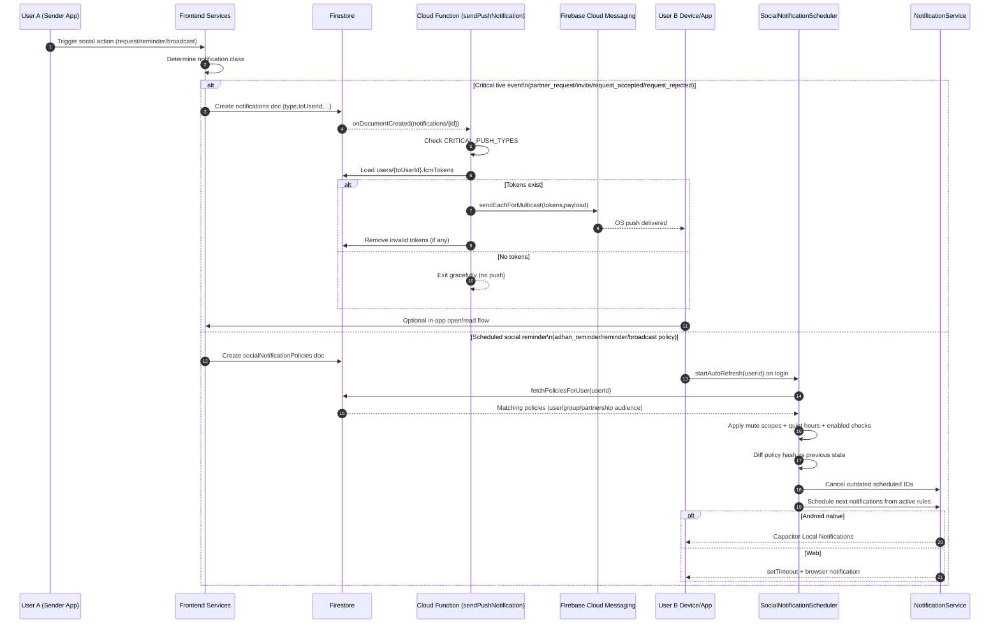

# Unified Notification Flow (Mermaid Sequence)

This diagram shows how the app routes social notifications between:

- **Critical live events** -> Firestore `notifications` + Cloud Function + FCM push
- **Scheduled reminders** -> Firestore `socialNotificationPolicies` + local scheduler

## Routing Rule (simple)

- If event is in critical set -> **Cloud push path**
- Otherwise for scheduled/social reminder behaviors -> **Policy + local scheduler path**

## Notes

- This hybrid design minimizes backend cost for recurring reminders.
- Critical events still reach users when app is closed.
- Local policy path supports user controls (mute scopes, quiet hours, sync toggle).

